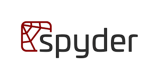

# Python Basics

```{image} ../_images/1_Python_logo.png
:width: 300
```

```{figure} ../_images/1_Guido_van_Rossum.jpeg
:figclass: margin

Guido van Rossum
```

Python is a high-level, interpreted programming language known for its simplicity and readability. It was created by <a href="https://en.wikipedia.org/wiki/Guido_van_Rossum" target="_blank">Guido van Rossum</a> and first released in 1991. Python's design philosophy emphasizes code readability and a syntax that allows programmers to express concepts in fewer lines of code compared to languages like C++ or Java.

## Spyder



An Integrated Development Environment (IDE) is a piece of software that provides a way of writing and organising your Python programs as well as a number of useful tools for debugging and organising your code. There are a number of IDEs available for working with Python and the one which we will be using is **Spyder** which is installed on the PCs in the Central Block.

```{figure} ../_images/1_Spyder.png
:width: 800
```

The Spyder window is divided into three panes. The large pane on the left is the editor which is where we can write our Python programs. The pane in the bottom right-hand corner is the console which can be used to enter single line Python commands and is also where Python output is printed by default. The pane in the top right-hand corner contains tools to help us work with Python. For most of our work we will be working with the editor and console panes.
